# Full Stack API Development with ExpressJS, PostgreSQL, and Prisma

## Project Overview

This project provides a RESTful API to manage a simplified project management system where users can create and manage projects, assign tasks, and track task statuses. It is built using **ExpressJS**, **PostgreSQL**, and **Prisma**.

## Technologies Used

- **Node.js** (Backend)
- **ExpressJS** (Web framework)
- **PostgreSQL** (Database)
- **Prisma ORM** (Database interaction)
- **JWT Authentication** (User authentication)
- **UUID** (Unique identifiers)

## Features

1. **User Management:**
   - Create, Update, Delete, and List Users
   - Validate uniqueness of the user’s email

2. **Project Management:**
   - Create, Update, Delete, and List Projects

3. **Task Management:**
   - Add tasks to projects
   - Assign tasks to users
   - Update task status (e.g., from TODO to IN_PROGRESS to DONE)

4. **Permissions:**
   - Only users assigned to a task or project can update it.

5. **Filter and Search:**
   - Filter tasks by status and assigned user.
   - List tasks for a specific project with the ability to filter by task status.

## API Endpoints

### User Endpoints:

- **POST /users**: Create a user.
- **GET /users**: List all users.
- **PUT /users/:id**: Update a user.
- **DELETE /users/:id**: Delete a user.

### Project Endpoints:

- **POST /projects**: Create a project.
- **GET /projects**: List all projects.
- **PUT /projects/:id**: Update a project.
- **DELETE /projects/:id**: Delete a project.

### Task Endpoints:

- **POST /projects/:projectId/tasks**: Create a task under a project.
- **GET /projects/:projectId/tasks**: List tasks for a project.
- **PUT /tasks/:id**: Update task details or status.
- **DELETE /tasks/:id**: Delete a task.

### Filter Endpoints:

- **GET /tasks?status=IN_PROGRESS&assignedUserId=uuid**: Filter tasks by status and assigned user.

## Database Setup

The application uses **PostgreSQL** as the database and **Prisma ORM** for database interaction.

### Setting Up the Database

1. **Install PostgreSQL**: Make sure you have PostgreSQL installed on your machine.

2. **Create a Database**: Create a new PostgreSQL database, e.g., `project_management`.

3. **Prisma Setup**:
   - Install Prisma CLI:
     ```bash
     npm install @prisma/cli --save-dev
     ```
   - Initialize Prisma in your project:
     ```bash
     npx prisma init
     ```
   - Update the `DATABASE_URL` in `prisma/.env` with your PostgreSQL database connection string.

4. **Prisma Migrations**:
   - Create the database schema using Prisma:
     ```bash
     npx prisma migrate dev --name init
     ```

5. **Generate Prisma Client**:
   - Generate the Prisma client to interact with the database:
     ```bash
     npx prisma generate
     ```

## Authentication

The API uses **JWT (JSON Web Tokens)** for user authentication. Users must authenticate to access protected routes. Upon successful login, a JWT token is returned and should be included in the `Authorization` header as `Bearer <token>` for subsequent requests.

### JWT Authentication

- **POST /login**: User login. Requires email and password. Returns a JWT token.
  Example request body:
  ```json
  {
    "email": "user@example.com",
    "password": "password123"
  }

# API Documentation

## 1. Create User
This endpoint creates a new user.

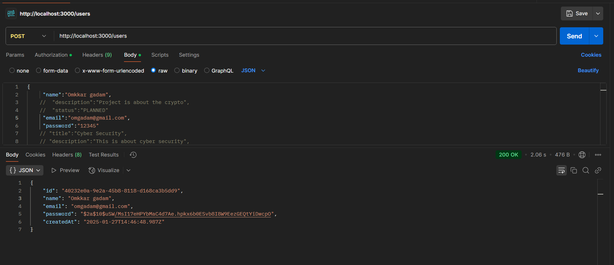


## 2. List All User
This endpoint List All User.

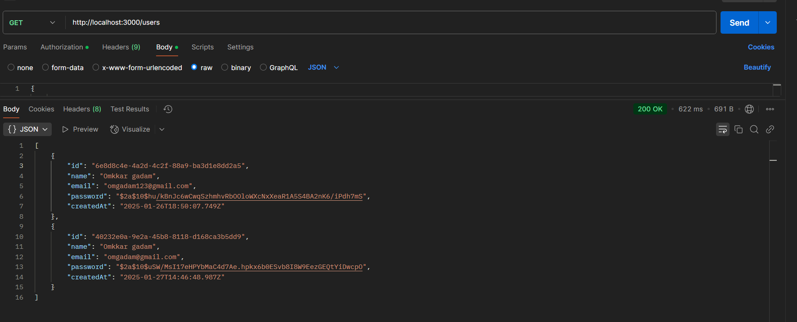


## 3. Update a User
This endpoint Updates a User.

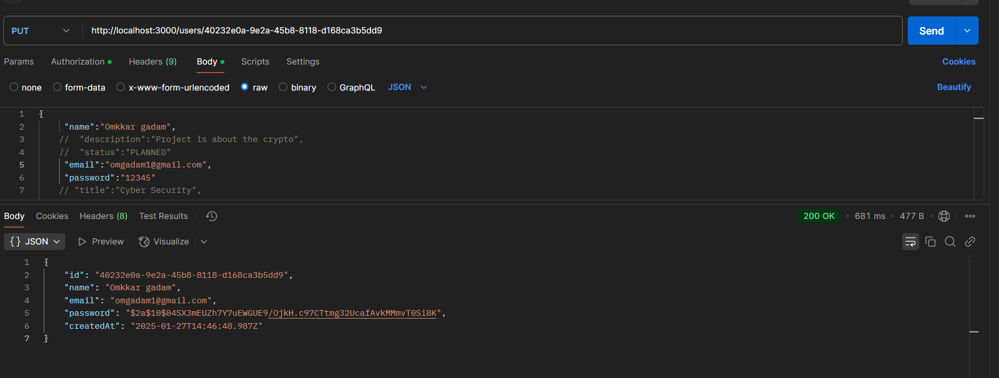


## 4. Delete a User
This endpoint Deletes a User.

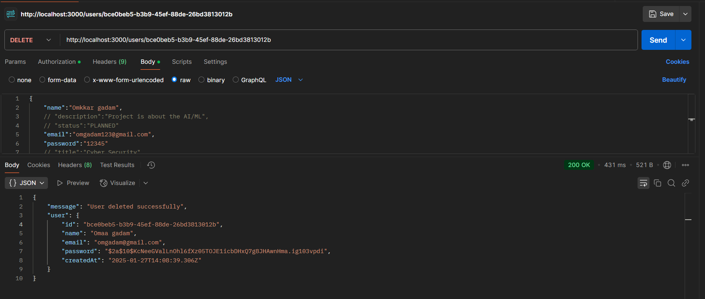

## 5. Create a Project
This endpoint Creates a Project

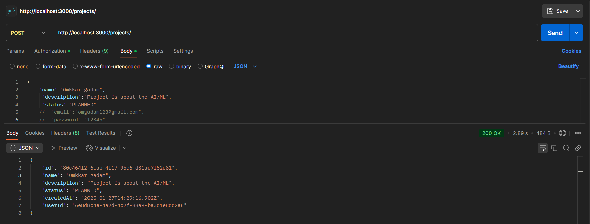


## 6. List All Projects
This endpoint List All Projects

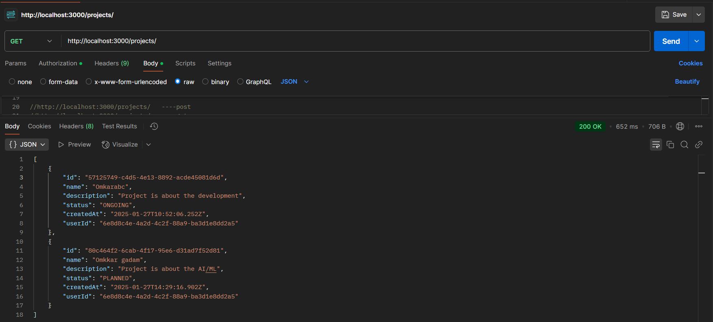

## 7. Update a Project
This endpoint Updates a Project

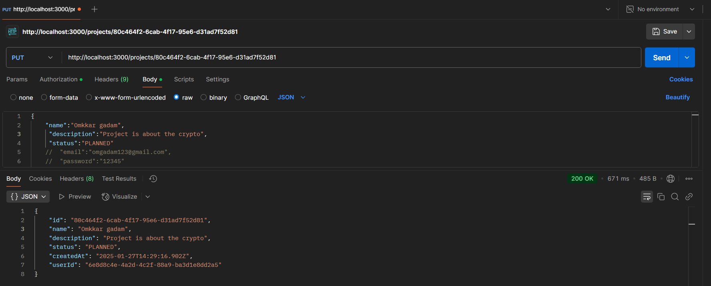

## 8. Delete a Project
This endpoint Delete a Project

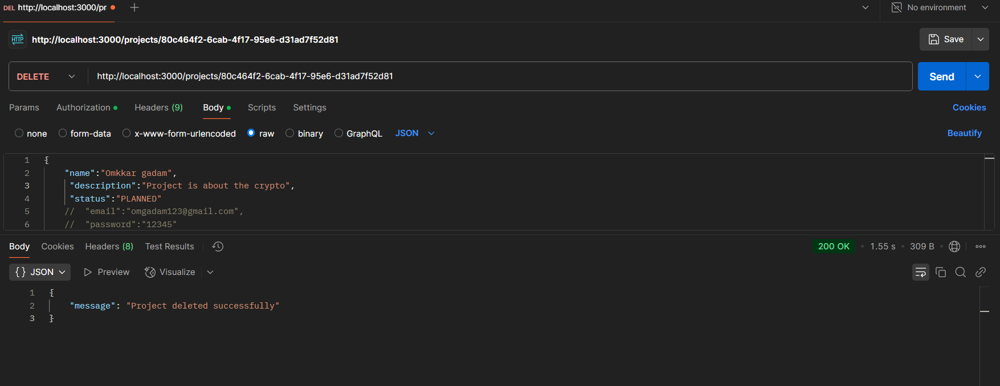

## 9. Create Task Under Project
This endpoint Creates Task Under Project

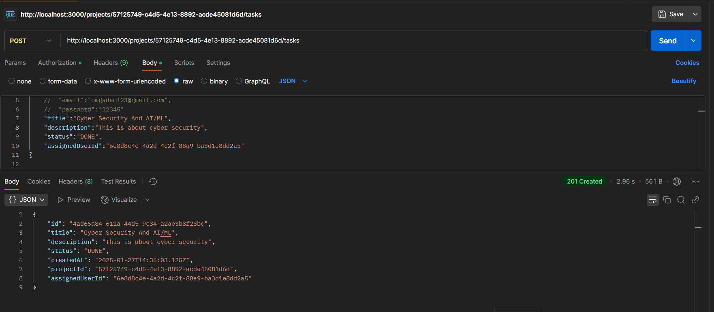

## 10. List All Task for Project
This endpoint List All Task for Project

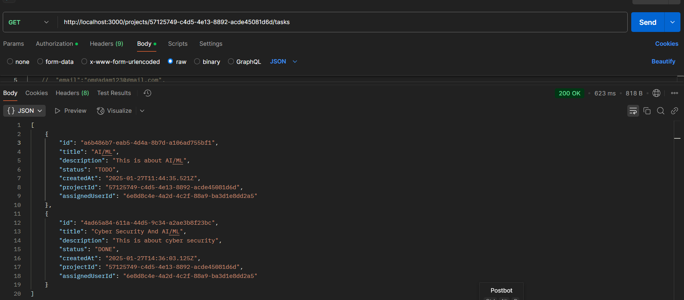

## 11. Updates the Task
This endpoint Updates the Task

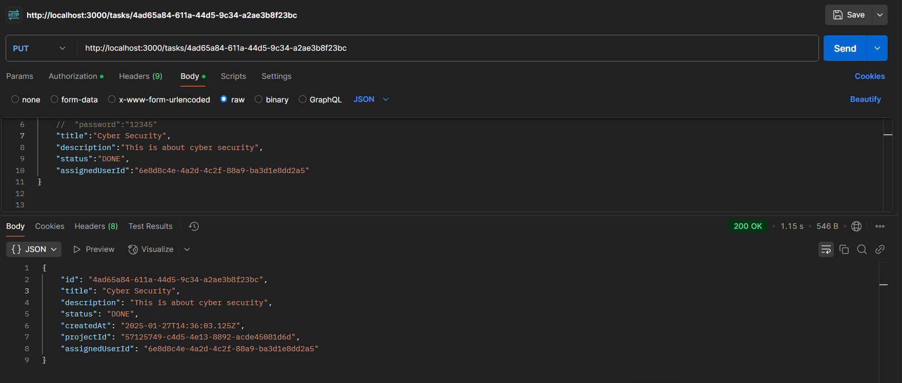

## 12. Deletes the Task
This endpoint Deletes the Task

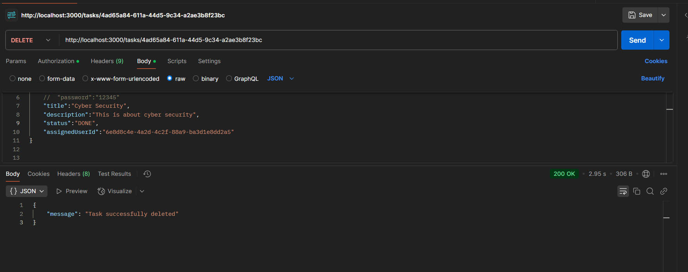

## 13. Filter task by status and assigned User
This endpoint Filter the task by status and assigned user

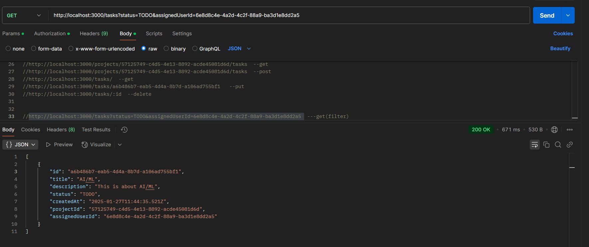


